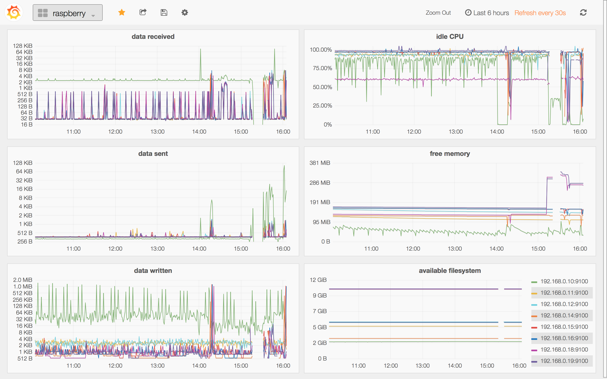
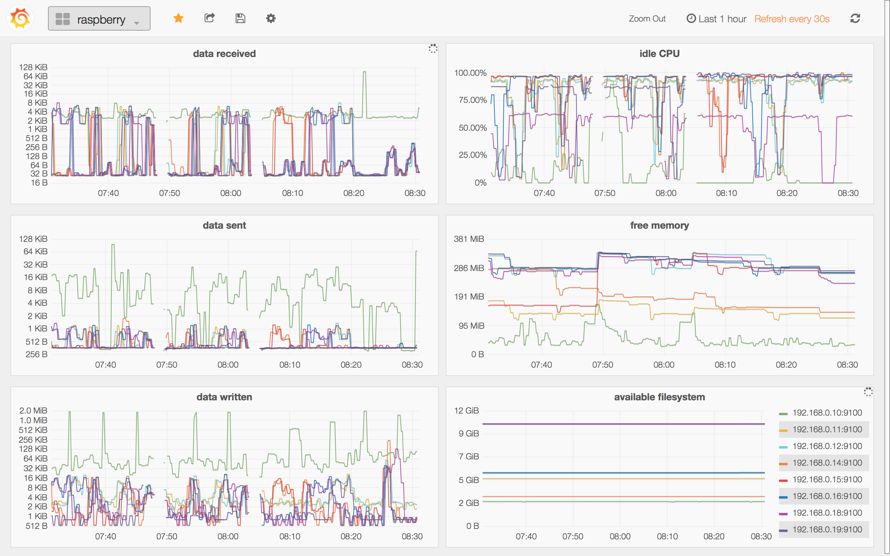
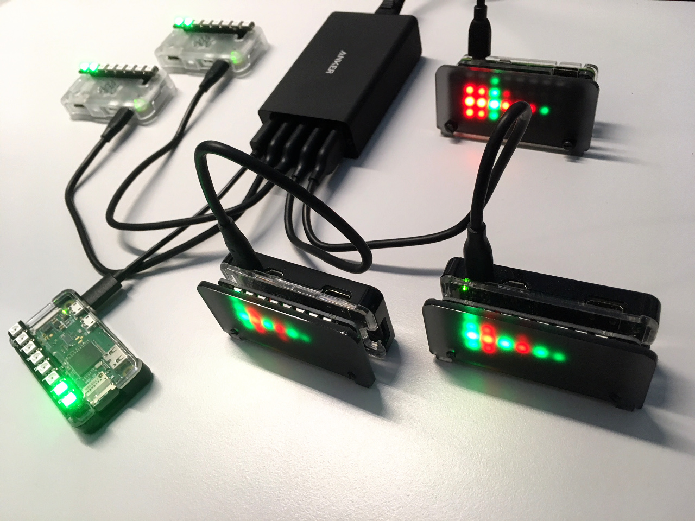
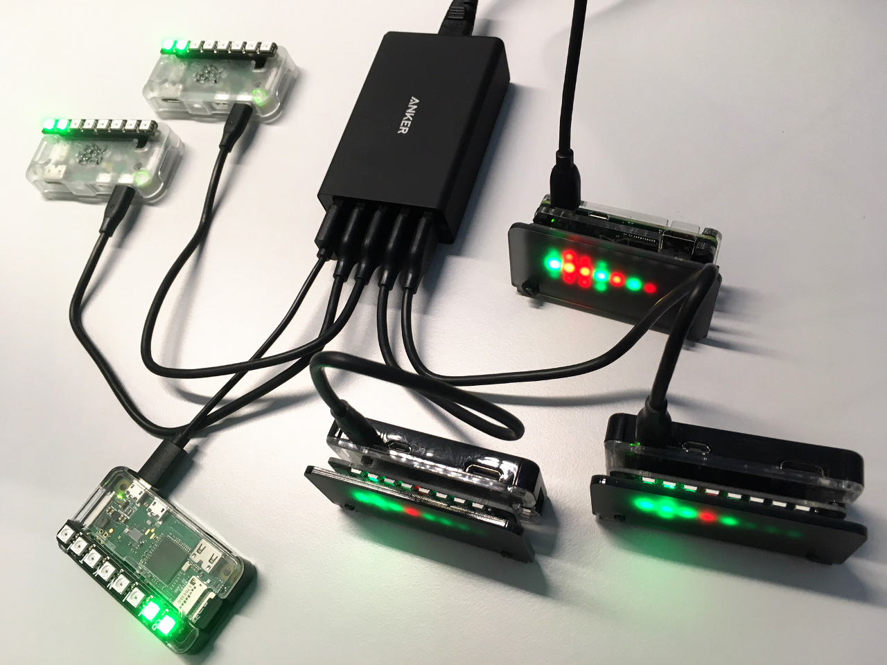

## Summary

- @Ansible for deploying all @Raspberry_PI
- @Prometheus / @Grafana for metrics
- @Pimoroni / @Adafruit LEDs for status

## Systems Management

 

 Ansible:
docs: [ansible.com/playbook_roles](http://docs.ansible.com/ansible/latest/playbooks_reuse_roles.html)
demo: [tree/master/ansible](ansible)

 Grafana:
docs: [docs.grafana/prometheus](http://docs.grafana.org/features/datasources/prometheus)
demo: [192.168.0.10:3000/datasources](http://192.168.0.10:3000/datasources)

 Prometheus:
docs: [prometheus.io/docs/grafana](https://prometheus.io/docs/visualization/grafana)
demo: [192.168.0.10:9090/targets](http://192.168.0.10:9090/targets)

## Status Displays

 

Adafruit 16x2 CharLCD :pager:
examples: [adafruit/Adafruit_Python_CharLCD/examples](https://github.com/adafruit/Adafruit_Python_CharLCD/tree/master/examples/)
docs: [learn.adafruit.com/16x2-character-lcd](https://learn.adafruit.com/adafruit-16x2-character-lcd-plus-keypad-for-raspberry-pi?view=all)

Pimoroni unicorn-hat :unicorn:
examples: [pimoroni/unicorn-hat/examples](https://github.com/pimoroni/unicorn-hat/blob/master/examples/)
docs: [docs.pimoroni/unicornhat](http://docs.pimoroni.com/unicornhat/)

Pimoroni blinkt! :traffic_light:
examples: [pimoroni/blinkt/examples](https://github.com/pimoroni/blinkt/blob/master/examples/)
docs: [docs.pimoroni/blinkt](http://docs.pimoroni.com/blinkt/)
